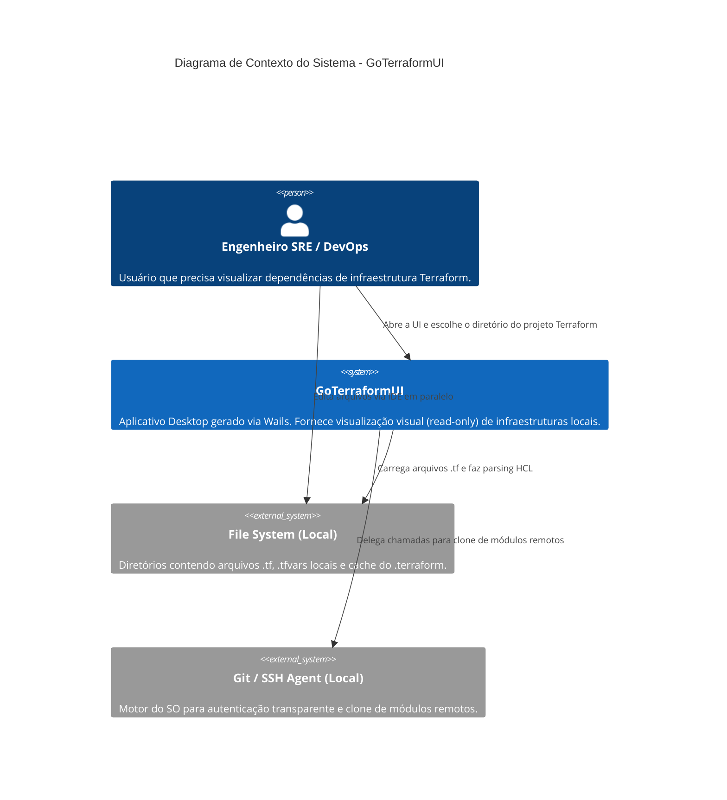
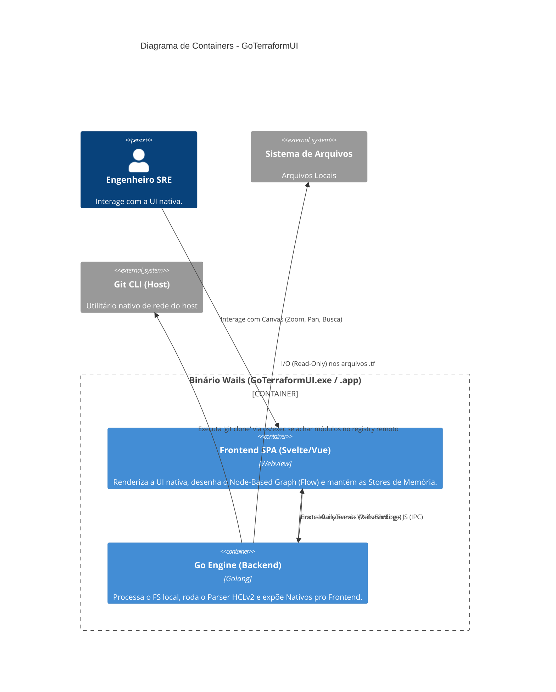

# Arquitetura de Componentes

Este documento descreve a arquitetura do **GoTerraformUI**, um aplicativo desktop focado na visualização de repositórios Terraform, baseado no framework Wails.

A decisão arquitetural principal baseia-se em um **Monorepo Enxuto** com comunicação via **Bindings Nativos (Wails)** e um **Store Global de UI** no Frontend.

## Diagrama de Contexto (C4 Nível 1)

## Diagrama de Container (C4 Nível 2)

## Organização de Componentes Internos
- **Frontend SPA**: Framework Svelte ou Vue (com Vite). Uso da lib `Svelte Flow` ou `Vue Flow` para plotagem das caixas. Uso de Pinia ou Svelte Stores para manter a listagem de *nodes* e *edges*.
- **Backend (Go)**:
  - `parser`: Pacote envolvendo `hashicorp/hcl/v2` para ler AST.
  - `resolver`: Pacote para interpretar caminhos de módulos (local vs. Git).
  - `wails_bindings`: Structs exportadas com os métodos que serão chamados pelo JS (`GetTerraformGraph(path string)`).
