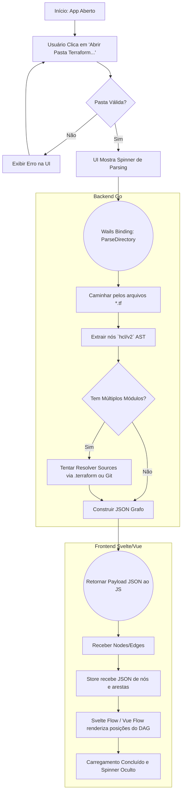
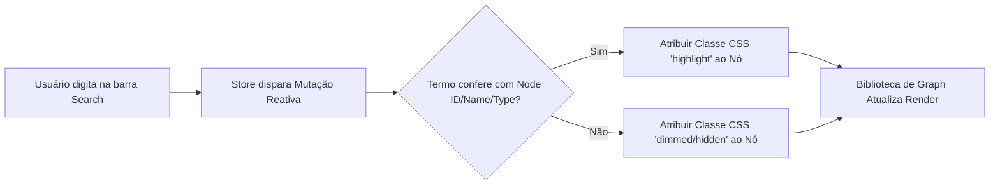

# Fluxos do Sistema

Este documento ilustra a jornada do usuário e os fluxos de dados do processo essencial (core) do MVP.

## Fluxo Principal de Carregamento

Descreve o caminho desde o momento que o usuário abre o App até visualizar a árvore.

## Fluxo Lógico do Motor de Busca / Filtro

Como os dados estão cacheados no frontend, a busca é instantânea e ocorre 100% no *client-side* webview.

